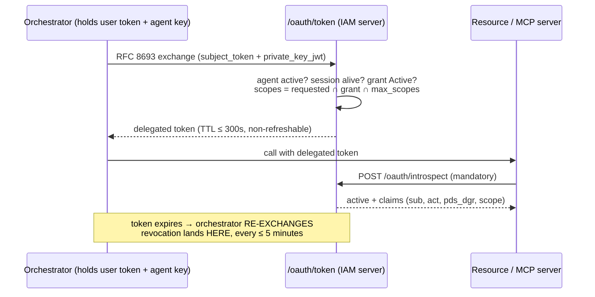

# Delegated token lifecycle

## The three deliberate constraints

### 1. TTL ≤ 300 s (hard cap 900 in code)

A delegated token is a **fast-path credential, not a source of truth**. The shorter it lives, the
shorter the maximum staleness after a revocation. The 900-second cap is enforced in
`TokenExchangeGrant` — configuration cannot raise it, because raising it silently converts "revoked
at the next check" into "revoked at expiry".

### 2. No refresh token — the re-exchange IS the freshness check

A refresh token would be a *long-lived* credential in the agent's hands — exactly what delegation
exists to avoid. Instead, when the token expires the orchestrator exchanges again, and **every
exchange re-verifies**: agent still `active`, user's session still alive in the SessionRegistry,
grant still `Active`, scopes still inside the intersection. Revocation, suspension, logout — all
land within one TTL, automatically.

### 3. Introspection-mandatory verification

A resource server that trusts local signature parsing keeps honouring a delegated token for its
whole TTL even after revocation — and a *legacy* verifier that ignores `act` would treat it as the
user's full authority. So delegated tokens are verified by asking the server
([client guide](https://doc.laravel-iam-client.padosoft.com/guides/delegated-access)): the answer
includes session liveness and the authoritative claims. `typ: delegated+jwt` and a dedicated `aud`
are hygiene layers on top — never the defence.

## Revocation, end to end

| Who revokes | How | Lands |
| --- | --- | --- |
| The user | `DELETE /iam/me/delegations/{grantId}` — one click, **no step-up** (revoking must always be easier than granting) | Next introspection/`checkDelegated` citing `pds_dgr` denies; next exchange refuses |
| An admin | `POST …/delegation-grants/{id}/revoke` (console kill-switch) | Same |
| Agent suspension | `POST …/agents/{id}/suspend` | Every grant of that agent stops working (agent layer denies) |
| User logout / session revoked | Server session registry | Next **exchange** refuses (`sid` liveness re-checked); introspection reports inactive |
| Webhook push | Sealed audit events (`iam.delegation.grant.revoked`, …) are pushed to subscribers | PEPs/agents learn without polling |

Maximum staleness in every row: **one delegated TTL** (≤ 5 minutes by default).
