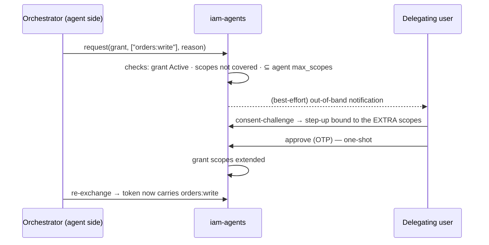

# Budget-bounded delegation & JIT scope elevation

Two v1.1 features, one philosophy: the delegation grant is a **living contract** between a human
and an agent. Budgets make the contract quantitative; elevation makes it renegotiable — always
with the human on the approving end.

## Budget-bounded delegation

> *Scopes limit **authority** (what the agent may do). Budgets limit **intensity** (how much of
> it the agent may consume).* A support copilot with `orders:read` and a €25 budget cannot rack
> up a thousand LLM calls on your bill, however legitimate each individual call looks.

### The `DelegationBudget` value object

A grant optionally carries a budget with up to three caps — at least one is mandatory, all must
be positive:

```php
use Padosoft\Iam\Contracts\Delegation\DelegationBudget;

new DelegationBudget(
    amount: 25.0,        // spend cap, in `currency`
    currency: 'EUR',
    tokens: 500_000,     // LLM token cap
    calls: 200,          // invocation cap
);
```

Pass it as a `budget` object on both self-service consent calls
(`POST /iam/me/delegations/consent-challenge` and `POST /iam/me/delegations`):

```json
{ "agent_id": "agt_…", "scopes": ["orders:read"], "ttl_seconds": 86400,
  "purpose": "Order assistance", "budget": { "amount": 25.0, "currency": "EUR", "calls": 200 } }
```

### The budget is part of the consent binding

The budget enters the dynamic-linking hash exactly like the other four parameters: a budget that
changes between challenge and confirmation **invalidates the confirmation**. The user approves
*"€25, 200 calls"* — not "some budget". See [Consent](/guides/consent) for the binding mechanics.

### Enforcement at exchange — fail-closed, meter-agnostic

The module does not meter usage itself. It defines the port and **refuses to look away**:

| Situation at exchange time | Outcome |
| --- | --- |
| Grant has no budget | Exchange proceeds; the guard is never consulted |
| Grant has a budget, **no `DelegationBudgetGuard` bound** | `invalid_grant` — audited as `delegation_budget_unenforceable`. A budget nobody can enforce is a promise to the user that would silently be broken |
| Guard verdict: deny | `invalid_grant` — audited as `delegation_budget_exhausted: <reason>` |
| Guard verdict: allow | Exchange proceeds (the verdict can carry `remaining` counters) |

The port lives in `laravel-iam-contracts`:

```php
interface DelegationBudgetGuard
{
    public function verdict(DelegationGrant $grant): BudgetVerdict; // allow(…) | deny(reason)
}
```

::: callout tip "The reference meter is laravel-ai-finops" icon:coins
[`padosoft/laravel-ai-finops`](https://github.com/padosoft/laravel-ai-finops) ships a
ledger-backed guard: every AI call attributed to a `delegation_grant_id` accrues against the
grant's caps, and the next exchange is refused when a cap is crossed. Enable its
`iam_delegation` integration and the binding is automatic. Any other meter works too — bind your
own implementation of the contract.
:::

Because a short-TTL delegated token is re-exchanged every few minutes, budget exhaustion stops
the agent **within one token TTL** — no long-lived token keeps spending after the cap.

## JIT scope elevation

An agent holding `orders:read` discovers mid-task that it needs `orders:write`. Without
elevation: flat deny, dead run, human retypes everything. With elevation: the agent (through its
server-side orchestrator) *asks*, the delegating human *decides*.



### The rules, all fail-closed

- A request is born only on an **Active, unexpired grant**, for scopes **not already covered**,
  and **inside the agent's `max_scopes` ceiling**. The ceiling approved by your admins is
  structural — no amount of user consent raises it.
- A pending request **expires on its own** (`elevation.pending_ttl_minutes`, default 15). An
  ignored request never elevates anything.
- **Approving is a full re-consent**: the same step-up verifier used for the original grant, with
  dynamic linking bound to the *extra* scopes and a dedicated purpose
  (`iam-delegation-elevation: <reason>`). The binding parameters are derived **server-side from
  the stored request** — the user approves exactly what the agent asked, never a variant.
- The approval is **one-shot** (UNIQUE on the consent confirmation id) and extends the grant's
  scopes atomically.
- **Denying is one click.** No step-up to refuse an extension of authority — refusing must always
  be easier than granting.
- Requests are only visible to and decidable by the **grant's own user**; anyone else gets
  "not found", never "not yours".

### Self-service endpoints

`GET /iam/me/delegations` now returns a `pending_elevations` array. Deciding:

| Route | Does |
| --- | --- |
| `POST /iam/me/delegations/elevations/{id}/consent-challenge` | Step 1: open the step-up bound to the extra scopes |
| `POST /iam/me/delegations/elevations/{id}/approve` | Step 2: verify + extend the grant (one-shot) |
| `POST /iam/me/delegations/elevations/{id}/deny` | One click, done |

### Out-of-band notification — informative, never authoritative

If `elevation.notifier` names an `ElevationNotifier` implementation, the module notifies the user
out-of-band when a request opens (the reference implementation is
[`padosoft/laravel-rebel-channels`](https://github.com/padosoft/laravel-rebel-channels):
Telegram/WhatsApp/SMS/voice with multi-channel fallback). Delivery is **best-effort**: a failed
notification is audited (`iam.delegation.elevation.notify_failed`) and the request stays visible
and decidable in self-service. The notification only *informs* — approval always happens through
the step-up flow above, never by replying to a message.

## The lifecycle port — letting detectors pull the brake

`AgentLifecycle` (in `laravel-iam-contracts`) is the suspend-only port for automated detectors:

```php
interface AgentLifecycle
{
    public function suspend(SubjectRef $agent, string $reason, string $actor): void;
}
```

The module's implementation is **idempotent and never throws** (a detector must not crash on an
already-suspended or unknown agent), audits the transition with the acting service as actor, and
dispatches `AgentSuspended`. This is the hook
[`padosoft/laravel-rebel-ai-guard`](https://github.com/padosoft/laravel-rebel-ai-guard) uses for
anomaly-driven auto-suspend (advisory by default — auto-suspend is an explicit opt-in there).

## Domain events — the compliance feed

v1.1 dispatches plain, final, readonly events consumed by
[`padosoft/laravel-ai-act-compliance`](https://github.com/padosoft/laravel-ai-act-compliance)
(grants as Art. 14 human-oversight items, agents in the Art. 6 risk register):

| Event | When |
| --- | --- |
| `DelegationGrantCreated` / `DelegationGrantRevoked` | Grant stored after verified consent / revoked (user or admin) |
| `AgentApproved` | The human gate: agent activated with its scopes ceiling |
| `AgentSuspended` / `AgentRetired` | Kill-switch (admin or detector) / terminal retirement |

All carry full value objects (grant VO + agent name, or agent id/name/operator/ceiling/actor) —
listeners never need to re-query the module.
