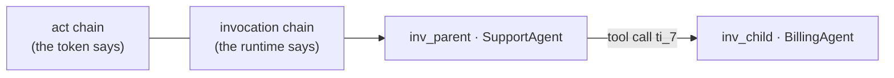

# Run Correlation

The delegation context answers *who did what, on whose behalf*. It is hydrated
once at the edge and rides the Laravel Context into every log line and every
queued job, so a package writes it without knowing delegation exists.

What it could not answer was **which run**.

::: callout info
Needs `laravel/ai` **^0.11**. It is not a dependency of this module — an IAM that
hosts no AI agents should not have to install an AI SDK — so the listener is
guarded on the event classes existing.
:::

## The gap

A FinOps ledger row and an eval trajectory both belong to *some* agent run. Until
0.11 the only way to say which was timestamp proximity: good enough while one run
happens at a time, and wrong exactly when two overlap — which is when you are
most likely to be investigating.

`laravel/ai` 0.11 threads one `invocationId` through an entire run and reports it
on every step and tool event. So the module stamps it onto the ambient context:

```php
[
    'sub' => 'user:42',
    'actors' => ['agent:01J8...'],
    'grant_id' => 'dgr_01J9...',
    'invocation_id' => 'inv_01K2...',        // ← the join key
    'parent_invocation_id' => 'inv_01K1...', // ← when this agent is a tool of another
    'parent_tool_invocation_id' => 'ti_7',
]
```

Every record written while that run executes now carries them, and the pivot
queries the design promised become exact:

```sql
-- Everything one run cost, did and decided, across packages.
SELECT * FROM ai_finops_run_events   WHERE invocation_id = 'inv_01K2...';
SELECT * FROM iam_audit_events       WHERE json_extract(context, '$.invocation_id') = 'inv_01K2...';
```

## The parent hop is the act chain, from the other side

When an agent is used as a **tool** of another agent, `laravel/ai` runs the child
inside `ParentInvocation::within(...)`, so the child knows both the invocation it
came from and the exact tool call that spawned it.

That is the same parent→child relationship the nested `act` claim describes — one
recorded by the token, the other by the runtime. Having both means a delegation
chain can be checked against what actually ran.



## Why the stamp is cleared

`AgentPrompted` and `AgentFailed` both remove it.

Leaving it attached is worse than never setting it: the process goes on doing
other work, and every later log line would be attributed to a run that is no
longer going. A pivot on `invocation_id` would then count work that was not the
run's — a wrong answer, delivered with the confidence of an exact join.

A sibling run finishing does not clear another run's id; only the invocation that
was stamped can unstamp itself.

## What it will not do

- **It never invents a context.** A run with no `iam_delegation` hydrated is left
  alone, so a non-delegated run does not acquire an empty delegation record.
- **It emits nothing of its own.** No audit rows, no events — it enriches what
  other packages were already writing.

Turn it off with `iam-agents.run_correlation` (env `IAM_AGENTS_RUN_CORRELATION`).
